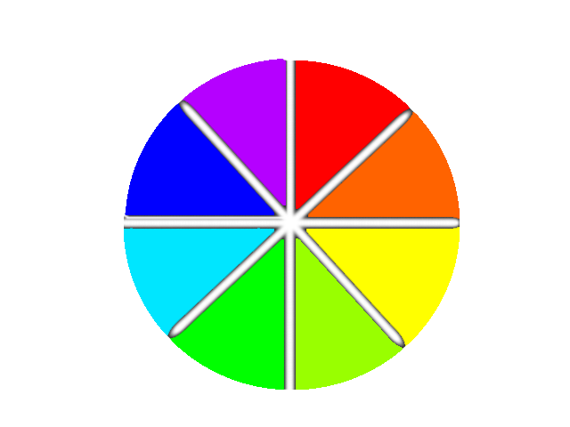

# How to Hack Locks

## EZ_21

`example.pub { ez_21:"key" }`

`key1` will be one of the following:

- open
- unlock
- release

## EZ_35

`example.pub { EZ_35:"key1", digit:key2 }`

`key1` will be one of the following:

- open
- unlock
- release

`key2` will be number between 0-9 as far as i have encountered.

## EZ_40

`example.pub { EZ_40:"key1", ez_prime:key2 }`

`key1` will be one of the following:

- open
- unlock
- release

`key2` will be a prime number 2-97.

|     |     |     |     |     |
| --- | --- | --- | --- | --- |
| 2   | 3   | 5   | 7   | 11  |
| 13  | 17  | 19  | 23  | 29  |
| 31  | 37  | 41  | 43  | 47  |
| 53  | 59  | 61  | 67  | 71  |
| 73  | 79  | 83  | 89  | 97  |

## c001

`example.pub { c001:"key", color_digit: key2 }`

`key1` will be one of the following:

- red
- orange
- yellow
- green
- lime
- blue
- cyan
- purple

`key2` will be number between 0-9 as far as i have encountered.

## c002

`example.pub { c002:"key", c002_complement:"key2" }`

`key1` will be one of the following:

- red
- orange
- yellow
- green
- lime
- blue
- cyan
- purple

`key2` will be the opposite color based on:

## c003

`example.pub { c003:"key", c003_complement:"key2", c003_triad_2:"key3" }`

`key1` will be one of the following:

- red
- orange
- yellow
- green
- lime
- blue
- cyan
- purple

`key2` and `key3` will be the cross adjacent colors.

- So if coo3:"red" c003_triad_1 is either "cyan" or "lime" and c003_triad_2 is the other one.
- So if c003:"purple" c003_triad_1 is either "yellow" or "green" and c003_triad_3 is the other one.

More here: [how to hack locks in hackmud](https://steamcommunity.com/sharedfiles/filedetails/?id=779579222)
